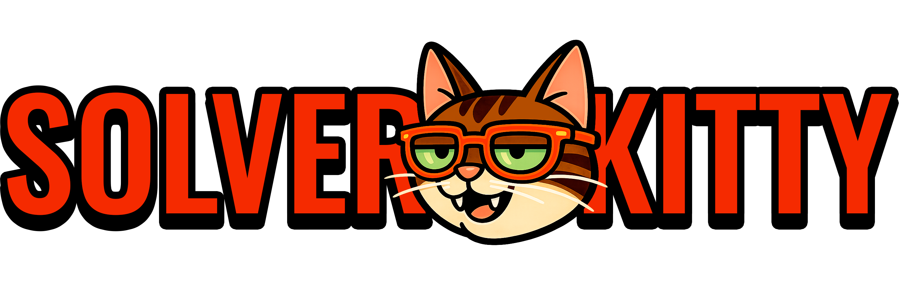
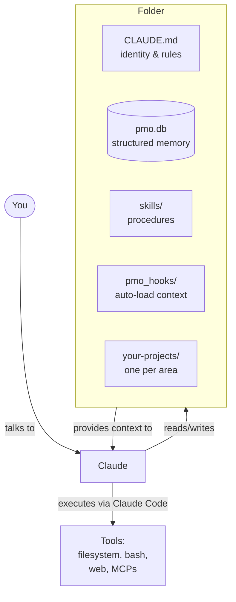

<div align="right">

[🇧🇷 Leia em português](README.pt-BR.md)

</div>

<div align="center">



[](https://opensource.org/licenses/MIT)
[](CHANGELOG.md)
[](https://claude.com/product/claude-code)
[](CONTRIBUTING.md)

**Build an agent. In a folder. In under a minute.**

</div>

---

## What is Solverkitty?

Solverkitty is a kit of files and Python scripts that turns your Claude Code into a **continuous work partner**. You create the folder, install it, and your agent starts to:

- **Remember what you do**, month after month (local SQLite — nothing leaves your machine)
- **Organize your projects** automatically (editorial filesystem)
- **Run procedures** you define (procedural skills)
- **Generate dashboards, reports, summaries** of your work

It's not a framework. It's not a heavy stack. **It's an editorial filesystem + SQLite + skills.**

The whole thing fits in a folder. The folder is the agent.

---

## Why does it exist?

For an agent to perform at its peak, it needs **two things**:

→ **Context** — what the agent *knows*
→ **Environment** — what the agent *can do*

Without context, the agent doesn't know what to do.
Without environment, it knows but can't execute.

**Most agent frameworks ship environment** — they help you wire APIs, define tools, orchestrate calls. LangChain, CrewAI, AutoGen — all environment-first.

**Almost none ship context well.** They assume you'll handle context via prompt engineering or runtime injection.

**Solverkitty is the opposite.** It doesn't give you new environment — Claude Code already does. It gives you the **context infrastructure**: editorial filesystem, auditable log, procedural skills, structured memory.

> **Solverkitty is the filesystem that becomes context. Claude Code is the engine that becomes environment. Together, they become an agent.**

📖 *Want the full philosophy? See [docs/PHILOSOPHY.md](docs/PHILOSOPHY.md).*

---

## Who is it for?

Anyone who works with their head and loses context between projects.

| Persona | Why it fits |
|---------|-------------|
| 🧠 **Solo founder / indie hacker** | Tracks 5+ projects in parallel without losing thread |
| 💼 **Consultant / freelancer** | One folder per client, history of decisions, deliverable archive |
| 🔬 **Researcher / academic** | Indexes papers, tracks experiments, generates monthly reviews |
| 📊 **Knowledge worker** | Replaces scattered notes with auditable system that survives across roles |
| 🎓 **Student / learner** | Tracks reading lists, study progress, projects, builds personal knowledge base |
| 🏪 **Small business owner** | Manages personal side of the business without mixing with company tools |

If you've ever opened a project after 3 weeks and thought *"where was I?"* — Solverkitty is for you.

---

## Quick start (1 minute)

```bash
git clone https://github.com/fernando-solver/solverkitty.git
cd solverkitty
python instalar.py
claude
```

Inside Claude Code:

```
/comecar
```

Done. Your agent is running.

> **Requirements:** Python 3.10+, [Claude Code](https://claude.com/product/claude-code), and an Anthropic account with credits.

---

## How it works



**Three principles:**

1. **The filesystem is the memory.** Each project folder carries its own `CLAUDE.md`, `historico.md`, and `objetivos.md` — the agent reads them and knows where you left off.
2. **SQLite is the log.** Every decision, bugfix, discovery is logged with a type. Auditable via SQL query.
3. **Skills are procedural.** Not documentation. Code the agent runs when you ask.

📖 *Want to go deeper? See [docs/ARCHITECTURE.md](docs/ARCHITECTURE.md).*

---

## Use cases

Real things you can do today, copy-paste ready:

### 1. Index a folder full of unread PDFs by topic

```
/skills run organizar-leitura

> "look at my PDFs folder, group them by topic, mark the 3 most relevant
   to read first based on my main goal"
```

### 2. Get a weekly review of your work

```
/skills run revisar-semana

> "read the last 7 days of activity log, tell me what advanced, what
   stalled, and one thing to focus on next week"
```

### 3. Resume a stale project in 30 seconds

```
/skills run resumo-projeto

> "I haven't touched this project in 2 weeks — give me a 1-paragraph
   summary of where I left off and 3 next steps"
```

### 4. Get a 30-day visualization of everything

```
/skills run visao-mes

> "generate a consolidated HTML dashboard of last month: top projects,
   activity heatmap, objectives progress. Open in browser."
```

### 5. Archive an inactive project cleanly

```
/skills run arquivar-pasta

> "this folder hasn't been touched in 90 days — archive it to
   _archive/ following the pattern, log the move, update the glossary"
```

📖 *More examples in [docs/USE_CASES.md](docs/USE_CASES.md).*

---

## Solverkitty vs alternatives

| | Vanilla Claude memory | claude-mem | LangChain / CrewAI | Notion / Obsidian | **Solverkitty** |
|---|---|---|---|---|---|
| **What it stores** | Your preferences | Conversation context | — (you build it) | Notes + databases | Projects, decisions, activities, objectives |
| **Structured?** | No (free text) | No (conversation memory) | If you build it | Database-style | Yes (SQLite + canonical files) |
| **Auditable?** | Opaque | Opaque | If you build it | Visible but manual | SQL-queryable |
| **Active or passive?** | Passive (Claude uses *if* it remembers) | Passive | Active (executes) | Passive | **Active** (hooks + skills + commands) |
| **Cross-LLM?** | No | No | Yes (provider-agnostic) | Yes (just files) | **Yes** (just files + Python) |
| **Learning curve** | Zero | Zero | Steep (framework) | Medium (manual structure) | Low (filesystem conventions) |
| **Best for** | Personal Claude prefs | Conversation continuity | Building agent products | Personal knowledge | Personal continuous operation |

**The honest take:** these aren't competitors. They're different layers.

- **claude-mem** keeps your conversation alive between sessions. Solverkitty keeps your *work* alive across months.
- **LangChain/CrewAI** are for shipping agent products to others. Solverkitty is for running your own work.
- **Notion/Obsidian** are passive notes. Solverkitty is an active system that executes procedures.

You can — and should — use multiple of these together.

---

## What's included in Core (v0.6)

> 🇧🇷 **A quick note on naming.** Commands and skills are in Brazilian Portuguese — Solverkitty was built by a Brazilian operator (Fernando Solver) who uses these names every day in his own work. **You don't need to speak Portuguese to use Solverkitty** — they're just names. A translation table is right below. Multi-language support (renaming everything to English, Spanish, etc.) is planned for **v0.7** — see [Roadmap](#roadmap).

### Translation guide (Portuguese → English)

| Command | What it does |
|---------|--------------|
| `/comecar` | *start* — first-time greeting + onboarding |
| `/setup-pessoal` | *personal setup* — you + agent + areas + main objective |
| `/proximo-passo` | *next step* — one concrete action aligned with your objective |
| `/nova-pasta` | *new folder* — creates a canonical project folder |
| `/dashboard` | (same word) — generates visual portrait of your work |
| `/compartilhar` | *share* — exports a project with credential scrubbing |
| `/fechar-dia` | *close the day* — consolidates day's activity into the diary |
| `/instalar-stack` | *install stack* — installs specialized stacks |
| `/status` | (same word) — current workspace status |

| Skill | What it does |
|-------|--------------|
| `organizar-leitura` | *organize reading* — indexes a folder of PDFs by topic |
| `revisar-semana` | *weekly review* — last 7 days of activity |
| `resumo-projeto` | *project summary* — current state + next steps |
| `arquivar-pasta` | *archive folder* — preserves history |
| `visao-mes` | *month view* — consolidated monthly HTML |
| `compartilhar-projeto` | *share project* — export with credential scrubbing |
| `find-skill-local` | (English already) — discovers installed skills |
| `ver-dashboard` | *view dashboard* — opens the dashboard |
| `ogilvy-copywriting` | (English already) — assists with editorial copy |
| `analisar-planilha-excel` | *analyze excel spreadsheet* — exploratory analysis |
| `resumo-executivo` | *executive summary* — TL;DR + bullets + actions |

> 💡 **Want them in English right now?** Slash commands are just `.md` files in `.claude/commands/`. Skills are `.md` files in `skills/`. Rename them locally — takes 30 seconds, doesn't affect anything else. Or wait for the **v0.7 i18n release** (planned).

---

### Full list

**Commands** (slash commands inside Claude Code):
- `/comecar` — first-time greeting + onboarding (5 minutes)
- `/setup-pessoal` — initial setup: you + agent + areas + main objective
- `/proximo-passo` — suggests one concrete action aligned with your objective
- `/nova-pasta` — creates a canonical project folder
- `/dashboard` — generates a visual portrait of your work
- `/compartilhar` — exports a project with credential scrubbing
- `/fechar-dia` — consolidates the day's activity into the diary
- `/instalar-stack` — installs specialized stacks (future)

**Procedural skills** (out-of-the-box):
- `organizar-leitura` — indexes a folder of PDFs by topic
- `revisar-semana` — weekly review of activity
- `resumo-projeto` — current state of a project + next steps
- `arquivar-pasta` — archives inactive folder while preserving history
- `visao-mes` — consolidated monthly HTML view
- `compartilhar-projeto` — export a project with credential scrubbing
- `find-skill-local` — discovers skills installed locally
- `ver-dashboard` — opens the dashboard
- `ogilvy-copywriting` — assists with editorial copy
- `analisar-planilha-excel` — exploratory analysis of unknown spreadsheets
- `resumo-executivo` — executive summary in 3 layers (TL;DR + bullets + actions)

**Python modules:**
- `pmo_db.py` — SQLite interface
- `pmo_setup.py` — project bootstrap
- `pmo_dashboard.py` — HTML dashboard generation
- `pmo_share.py` — export with credential scrubbing
- `pmo_stacks.py` — stack system (extensibility)
- `pmo_historico.py` — activity history management
- `pmo_index.py` — canonical indexing per project
- `pmo_preflight.py` — read-only diagnostics
- `pmo_tokens.py` — structural tokens
- `pmo_hooks/session_start.py` — context auto-loaded at session boot

---

## Roadmap

- ✅ **v0.6 — Core for individuals** (current)
- 🌐 **v0.7 — i18n / multi-language** (planned) — commands and skills available in English, Spanish, and others alongside Portuguese
- 🛠️ **Stack Empresa** — generic enterprise PMO (in development)
- 🎯 **Stack Ecommerce** — Brazilian e-commerce operators
- 🎯 **Stack Consultor / Mentor / Educator** — knowledge sellers
- 🎯 **Stack Indústria** — small manufacturing
- 🎯 **Stack Serviços** — agencies, clinics, professional services

Stacks add specialized capabilities on top of Core. Core stays generic and stable.

📋 *See [CHANGELOG.md](CHANGELOG.md) for version history.*

---

## Documentation

| Document | What's inside |
|----------|---------------|
| [docs/PHILOSOPHY.md](docs/PHILOSOPHY.md) | The thesis — context + environment, why filesystem-as-agent |
| [docs/ARCHITECTURE.md](docs/ARCHITECTURE.md) | Deep technical dive — every component, how they interlock |
| [docs/USE_CASES.md](docs/USE_CASES.md) | 10+ real-world examples with copy-paste prompts |
| [SHOWCASE.md](SHOWCASE.md) | Who's using Solverkitty (add yours via PR) |
| [FAQ.md](FAQ.md) | Frequently asked questions |
| [CONTRIBUTING.md](CONTRIBUTING.md) | How to contribute |
| [CHANGELOG.md](CHANGELOG.md) | Release history |

---

## Contributing

Contributions are welcome — code, docs, skills, stacks, examples, bug reports.

The fastest path to contributing:

1. **Use Solverkitty for a few weeks** — file the rough edges as issues
2. **Add yourself to [SHOWCASE.md](SHOWCASE.md)** with a one-paragraph description of your use case
3. **Build a skill** for something you do repeatedly — submit it via PR
4. **Build a stack** for your domain (consulting, research, sales, etc) — opens a new vertical

See [CONTRIBUTING.md](CONTRIBUTING.md) for guidelines and [CODE_OF_CONDUCT.md](CODE_OF_CONDUCT.md) for community standards.

---

## FAQ (short version)

**Q: Does this replace Claude Code's own memory?**
A: No. It complements it. Claude Code memory is about *you* (preferences, style). Solverkitty is about your *work* (projects, history, decisions).

**Q: Can I use this without Claude Code?**
A: The files are pure markdown + Python — any LLM that reads filesystem can use them. But the slash commands, hooks, and agents are Claude Code-native. You'd lose ~70% of the value.

**Q: Does my data leave my machine?**
A: No. SQLite + filesystem only. The only data that goes to Anthropic is what Claude Code already sends during a session.

**Q: Is it really under 1 minute?**
A: From `git clone` to your first `/comecar` running, yes. The full personal setup (`/setup-pessoal`) takes another ~3 minutes — but that's a one-time thing.

📖 *Full FAQ in [FAQ.md](FAQ.md).*

---

## License & Credits

**License:** MIT — use it, modify it, ship it. Just keep the attribution.

**Credits:**
Built by [Fernando Solver](https://fernandosolver.com.br) in continuous collaboration with [Claude](https://claude.com) (Anthropic).
The cat Jorge inspired the mascot.

**Want to support?**
The most valuable contribution is using it and telling people. Stars, issues, PRs, and word of mouth all matter more than money. If you want to follow along: [@fernandosolver](https://instagram.com/fernandosolver) on Instagram, [fernandosolver.com.br](https://fernandosolver.com.br) for updates.

---

<div align="center">

*If Solverkitty saves you an hour, ⭐ star the repo. That's the whole tip jar.*

</div>
