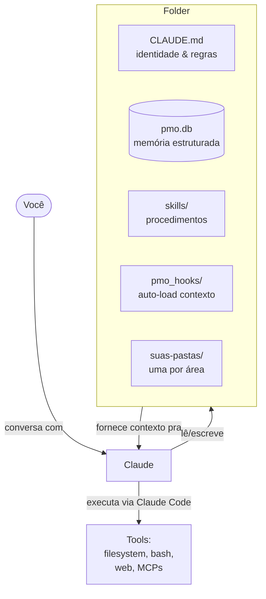

<div align="right">

[🇬🇧 Read in English](README.md)

</div>

<div align="center">


[](https://opensource.org/licenses/MIT)
[](CHANGELOG.md)
[](https://claude.com/product/claude-code)
[](CONTRIBUTING.md)

**Crie um agente. Em uma pasta. Em menos de 1 minuto.**

</div>

---

## O que é Solverkitty?

Solverkitty é um kit de arquivos + scripts Python que transforma seu Claude Code num **parceiro de trabalho contínuo**. Você cria a pasta, instala, e seu agente passa a:

- **Lembrar do que você faz**, mês a mês (SQLite local — nada vai pra nuvem)
- **Organizar seus projetos** automaticamente (filesystem editorial)
- **Executar rotinas** que você define (skills procedurais)
- **Gerar dashboards, relatórios, resumos** do seu trabalho

Não é framework. Não é stack pesada. **É filesystem editorial + SQLite + skills.**

A coisa toda cabe em uma pasta. **A pasta é o agente.**

---

## Por que existe?

Pra um agente performar ao máximo, ele precisa de **duas coisas**:

→ **Contexto** — o que o agente *sabe*
→ **Ambiente** — o que o agente *pode fazer*

Sem contexto, o agente não sabe o que fazer.
Sem ambiente, ele sabe mas não consegue executar.

**A maioria dos frameworks de agente entrega ambiente** — eles ajudam você a conectar APIs, definir tools, orquestrar chamadas. LangChain, CrewAI, AutoGen — todos environment-first.

**Quase nenhum entrega contexto bem.** Eles assumem que você vai construir contexto via prompt engineering ou injeção dinâmica.

**Solverkitty é o oposto.** Ele não te dá ambiente novo — Claude Code já dá. Ele te dá a **infraestrutura de contexto**: filesystem editorial, log auditável, skills procedurais, memória estruturada.

> **Solverkitty é o filesystem que vira contexto. Claude Code é o motor que vira ambiente. Junto, vira agente.**

📖 *Quer a filosofia completa? Veja [docs/PHILOSOPHY.md](docs/PHILOSOPHY.md).*

---

## Pra quem é

Pra quem trabalha com a cabeça e perde contexto entre projetos.

| Persona | Por que serve |
|---------|---------------|
| 🧠 **Founder solo / indie hacker** | Acompanha 5+ projetos paralelos sem perder o fio |
| 💼 **Consultor / freelancer** | Uma pasta por cliente, histórico de decisões, arquivo de entregáveis |
| 🔬 **Pesquisador / acadêmico** | Indexa papers, rastreia experimentos, gera revisões mensais |
| 📊 **Knowledge worker** | Substitui notas espalhadas por sistema auditável que sobrevive entre cargos |
| 🎓 **Estudante / autodidata** | Acompanha leituras, progresso de estudo, projetos, constrói base de conhecimento pessoal |
| 🏪 **Empresário pequeno** | Gerencia o lado pessoal do negócio sem misturar com ferramentas da empresa |

Se você já abriu um projeto depois de 3 semanas e pensou *"onde eu estava?"* — Solverkitty é pra você.

---

## Quick start (1 minuto)

```bash
git clone https://github.com/fernando-solver/solverkitty.git
cd solverkitty
python instalar.py
claude
```

Dentro do Claude Code:

```
/comecar
```

Pronto. Seu agente está rodando.

> **Pré-requisitos:** Python 3.10+, [Claude Code](https://claude.com/product/claude-code), e conta Anthropic com créditos.

---

## Como funciona



**Três princípios:**

1. **O filesystem é a memória.** Cada pasta de projeto carrega seu próprio `CLAUDE.md`, `historico.md`, `objetivos.md` — o agente lê e sabe onde paramos.
2. **SQLite é o log.** Toda decisão, bugfix, descoberta vai registrada com tipo. Auditável via SQL.
3. **Skills são procedurais.** Não documentação. Código que o agente executa quando você pede.

📖 *Quer aprofundar? Veja [docs/ARCHITECTURE.md](docs/ARCHITECTURE.md).*

---

## Casos de uso

Coisas reais que você pode fazer hoje, copy-paste:

### 1. Indexar pasta de PDFs não lidos por tema

```
/skills run organizar-leitura

> "olha minha pasta de PDFs, agrupa por tema, marca os 3 mais
   relevantes pra ler primeiro baseado no meu objetivo principal"
```

### 2. Revisão semanal automática

```
/skills run revisar-semana

> "lê os últimos 7 dias de log de atividade, me diz o que avançou,
   o que travou, e uma coisa pra focar na semana que vem"
```

### 3. Retomar projeto em 30 segundos

```
/skills run resumo-projeto

> "não toquei nesse projeto há 2 semanas — me dá um resumo de 1
   parágrafo de onde parei e 3 próximos passos"
```

### 4. Visão consolidada do mês

```
/skills run visao-mes

> "gera dashboard HTML do mês passado: top projetos, heatmap de
   atividade, progresso de objetivos. Abre no navegador."
```

### 5. Arquivar projeto inativo

```
/skills run arquivar-pasta

> "essa pasta não é tocada há 90 dias — arquiva pra _archive/
   seguindo o padrão, registra a movimentação, atualiza glossário"
```

📖 *Mais exemplos em [docs/USE_CASES.md](docs/USE_CASES.md).*

---

## Solverkitty vs alternativas

| | Memória do Claude | claude-mem | LangChain / CrewAI | Notion / Obsidian | **Solverkitty** |
|---|---|---|---|---|---|
| **O que armazena** | Suas preferências | Contexto da conversa | — (você constrói) | Notas + databases | Projetos, decisões, atividades, objetivos |
| **Estruturado?** | Não (texto livre) | Não (memória conversacional) | Se você construir | Tipo database | Sim (SQLite + arquivos canônicos) |
| **Auditável?** | Opaco | Opaco | Se você construir | Visível mas manual | Queryable via SQL |
| **Ativo ou passivo?** | Passivo (Claude usa *se* lembrar) | Passivo | Ativo (executa) | Passivo | **Ativo** (hooks + skills + commands) |
| **Cross-LLM?** | Não | Não | Sim (provider-agnostic) | Sim (só arquivos) | **Sim** (só arquivos + Python) |
| **Curva de aprendizado** | Zero | Zero | Íngreme (framework) | Média (estrutura manual) | Baixa (convenções de filesystem) |
| **Melhor pra** | Preferências pessoais Claude | Continuidade de conversa | Construir produtos de agente | Conhecimento pessoal | Operação contínua pessoal |

**A leitura honesta:** essas ferramentas não são concorrentes. São camadas diferentes.

- **claude-mem** mantém sua *conversa* viva entre sessões. Solverkitty mantém seu *trabalho* vivo ao longo de meses.
- **LangChain/CrewAI** são pra construir produtos de agente pra outros. Solverkitty é pra rodar seu próprio trabalho.
- **Notion/Obsidian** são notas passivas. Solverkitty é sistema ativo que executa rotinas.

Você pode — e deveria — usar várias delas juntas.

---

## O que vem com o Core (v0.6)

**Comandos** (slash commands no Claude Code):
- `/comecar` — apresentação + onboarding inicial (5 minutos)
- `/setup-pessoal` — cadastro inicial: você + agente + áreas + objetivo principal
- `/proximo-passo` — sugere uma ação concreta alinhada ao seu objetivo
- `/nova-pasta` — cria uma pasta de projeto canônica
- `/dashboard` — gera retrato visual do seu trabalho
- `/compartilhar` — exporta projeto com scrub de credenciais
- `/fechar-dia` — consolida a atividade do dia no diário
- `/instalar-stack` — instala stacks especializados (futuros)

**Skills procedurais (já incluídas):**
- `organizar-leitura` — indexa pasta de PDFs por tema
- `revisar-semana` — revisão semanal de atividade
- `resumo-projeto` — estado atual de um projeto + próximos passos
- `arquivar-pasta` — arquiva pasta inativa preservando histórico
- `visao-mes` — visão consolidada mensal em HTML
- `compartilhar-projeto` — exporta projeto com scrub
- `find-skill-local` — descobre skills instaladas
- `ver-dashboard` — abre o dashboard
- `ogilvy-copywriting` — apoio com copy editorial
- `analisar-planilha-excel` — análise exploratória de planilhas
- `resumo-executivo` — sumário executivo em 3 camadas

**Módulos Python:**
- `pmo_db.py` — interface SQLite
- `pmo_setup.py` — bootstrap de projetos
- `pmo_dashboard.py` — geração de dashboard HTML
- `pmo_share.py` — exportação com scrub
- `pmo_stacks.py` — sistema de stacks
- `pmo_historico.py` — gestão do histórico
- `pmo_index.py` — indexação canônica
- `pmo_preflight.py` — diagnóstico read-only
- `pmo_tokens.py` — tokens estruturais
- `pmo_hooks/session_start.py` — contexto auto-carregado no boot

---

## Roadmap

- ✅ **v0.6 — Core pra pessoas** (atual)
- 🌐 **v0.7 — i18n / multi-idioma** (planejado) — comandos e skills em EN/ES além de PT
- 🛠️ **Stack Empresa** — PMO empresarial genérico (em desenvolvimento)
- 🎯 **Stack Ecommerce** — lojista BR
- 🎯 **Stack Consultor / Mentor / Educador** — quem vende conhecimento
- 🎯 **Stack Indústria pequena** — fábrica/manufatura
- 🎯 **Stack Serviços** — agência/clínica/escritório

📋 *Veja [CHANGELOG.md](CHANGELOG.md) pra histórico de versões.*

---

## Documentação

| Documento | O que tem |
|-----------|-----------|
| [docs/PHILOSOPHY.md](docs/PHILOSOPHY.md) | A tese — contexto + ambiente |
| [docs/ARCHITECTURE.md](docs/ARCHITECTURE.md) | Mergulho técnico profundo |
| [docs/USE_CASES.md](docs/USE_CASES.md) | 10+ exemplos reais |
| [SHOWCASE.md](SHOWCASE.md) | Quem está usando |
| [FAQ.md](FAQ.md) | Perguntas frequentes |
| [CONTRIBUTING.md](CONTRIBUTING.md) | Como contribuir |

---

## Contribuindo

Contribuições são bem-vindas — código, docs, skills, stacks, exemplos.

Caminho mais rápido:
1. **Use Solverkitty por algumas semanas** — registre as arestas como issues
2. **Adicione você em [SHOWCASE.md](SHOWCASE.md)**
3. **Construa uma skill** pra algo que você faz — submete via PR
4. **Construa um stack** pro seu domínio

Veja [CONTRIBUTING.md](CONTRIBUTING.md) e [CODE_OF_CONDUCT.md](CODE_OF_CONDUCT.md).

---

## Licença & Créditos

**MIT** — use, modifique, distribua. Mantém a atribuição.

Construído por [Fernando Solver](https://fernandosolver.com.br) em colaboração contínua com [Claude](https://claude.com) (Anthropic).
O gato Jorge inspirou o mascote.

Pra acompanhar: [@fernandosolver](https://instagram.com/fernandosolver) · [fernandosolver.com.br](https://fernandosolver.com.br)

---

<div align="center">

*Se Solverkitty te economizar 1 hora, ⭐ star o repo. Essa é a caixinha inteira.*

</div>
