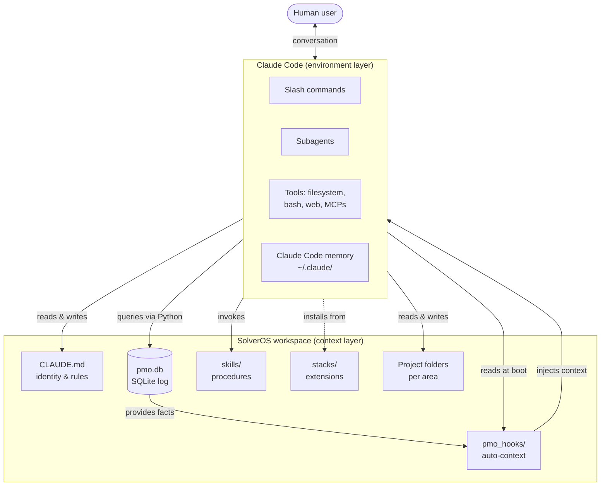

# Architecture — How SolverOS works under the hood

This is the deep technical dive. For the high-level pitch, see the [README](../README.md). For the philosophy, see [PHILOSOPHY.md](PHILOSOPHY.md).

---

## System overview



The **context layer** (SolverOS) provides memory, structure, and procedures.
The **environment layer** (Claude Code) provides execution, tool use, and conversation.
The **agent** emerges from their interaction.

---

## File layout

```
your-workspace/
├── README.md                       # Project documentation
├── CLAUDE.md                       # Workspace-level identity & rules (read by every session)
├── CHANGELOG.md
├── LICENSE
├── instalar.py                     # Bootstrap script

├── pmo_db.py                       # SQLite interface: sessions, activities, objectives, skills
├── pmo_setup.py                    # Project bootstrap functions
├── pmo_dashboard.py                # HTML dashboard generation
├── pmo_share.py                    # Project export with credential scrubbing
├── pmo_stacks.py                   # Stack system (list, install)
├── pmo_historico.py                # Activity history management
├── pmo_index.py                    # Canonical INDEX.md generation per project
├── pmo_preflight.py                # Read-only diagnostics
├── pmo_tokens.py                   # Structural tokens

├── pmo.db                          # SQLite database (created on first run)

├── pmo_hooks/
│   └── session_start.py            # Auto-loaded at every Claude Code session boot

├── .claude/
│   ├── settings.json               # Claude Code settings (hook registration)
│   └── commands/                   # Slash commands available in this workspace
│       ├── comecar.md
│       ├── setup-pessoal.md
│       ├── proximo-passo.md
│       ├── nova-pasta.md
│       ├── dashboard.md
│       ├── compartilhar.md
│       ├── fechar-dia.md
│       ├── status.md
│       └── instalar-stack.md

├── skills/                         # Active skills in this workspace
│   ├── README.md
│   ├── skill_compartilhar-projeto.md
│   ├── skill_pessoal_01_organizar-leitura.md
│   └── ... (one .md per skill)

├── stacks/                         # Stacks installed
│   └── core/                       # Always present
│       ├── manifest.yaml
│       ├── _template/              # Project folder template
│       ├── commands/               # Commands provided by this stack
│       ├── hooks/                  # Hooks provided
│       └── skills/                 # Skills provided

├── assets/                         # Images (logo, etc)
└── <your-project-folders>/         # One per area you organize
    ├── CLAUDE.md                   # Project-level briefing
    ├── historico.md                # Append-only chronological log
    ├── objetivos.md                # Project-specific objectives
    ├── INDEX.md                    # Canonical index (auto-generated)
    ├── inbox/                      # Unclassified drops
    ├── saidas/                     # Final deliverables
    ├── _archive/                   # Obsolete versions
    └── <subfolders>/               # Free structure per project
```

---

## SQLite schema

The `pmo.db` is the structured memory. Schema (simplified):

```sql
CREATE TABLE sessions (
    id INTEGER PRIMARY KEY,
    started_at TEXT,
    ended_at TEXT,
    summary TEXT
);

CREATE TABLE activities (
    id INTEGER PRIMARY KEY,
    date TEXT,                       -- YYYY-MM-DD
    project TEXT,                    -- folder name or area slug
    type TEXT,                       -- decision | bugfix | feature | discovery | refactor | config | analysis | change
    summary TEXT,
    session_id INTEGER REFERENCES sessions(id)
);

CREATE TABLE objectives (
    id INTEGER PRIMARY KEY,
    cliente_id INTEGER,              -- nullable for personal use
    tipo TEXT,                       -- meta_30_dias | entregas_mes | horas_foco_dia | etc
    descricao TEXT,
    valor_alvo REAL,
    unidade TEXT,
    prazo TEXT,
    status TEXT                      -- ativo | concluido | abandonado
);

CREATE TABLE skills (
    id INTEGER PRIMARY KEY,
    name TEXT UNIQUE,
    description TEXT,
    trigger TEXT,
    file_path TEXT,
    version INTEGER,
    last_updated TEXT
);

CREATE TABLE skill_uses (
    id INTEGER PRIMARY KEY,
    skill_id INTEGER REFERENCES skills(id),
    project TEXT,
    session_id INTEGER REFERENCES sessions(id),
    outcome TEXT,                    -- sucesso | falha | parcial
    used_at TEXT
);
```

(See `pmo_db.py` for the actual schema and migrations.)

### Activity types — the controlled vocabulary

Every activity has a `type` from this list:

| Type | When to use |
|------|-------------|
| `feature` | Built something new (file, script, doc, capability) |
| `bugfix` | Fixed something broken |
| `decision` | Took a decision that affects future direction |
| `discovery` | Learned something non-obvious |
| `refactor` | Reorganized without functional change |
| `config` | Changed configuration / setup |
| `analysis` | Analyzed data, generated insight |
| `change` | Generic change that doesn't fit above |

Why constrained vocabulary? Because querying `WHERE type = 'decision'` is much more useful than scanning prose. The constraint is the value.

---

## CLAUDE.md — the identity contract

Every project (and the workspace root) has a `CLAUDE.md`. This file is read by Claude Code at the start of every session.

A good `CLAUDE.md` includes:

```markdown
# Project name

## Mission
What this project exists to do. 1-3 sentences.

## Context
What's the situation? Who depends on this? What's the deadline?

## Stakeholders
Who's involved.

## Files to know
- `script.py` — what it does
- `data/source.csv` — where data comes from
- `output/` — where deliverables go

## Rules
Constraints the agent must respect. Format conventions, exclusions, validations.

## Commands
Reusable procedures with clear inputs/outputs.

## History
Pointer to historico.md.
```

The `CLAUDE.md` is the **briefing for the agent**. It's how you transmit context once and have the agent absorb it forever.

---

## historico.md — the append-only log

Each project has a `historico.md` that's append-only:

```markdown
# Histórico — <project name>

## 2026-05-03
- [feature] Set up initial structure
- [decision] Chose SQLite over PostgreSQL — single user, zero infra cost

## 2026-05-02
- [discovery] Found that PDF library X handles encrypted files better than Y
```

Rules:
- Always append, never edit past
- Each entry has a `[type]` from the vocabulary
- Date in `YYYY-MM-DD` format

This file is what the agent reads when you ask "what did we decide last week?" — and it's why the answer is precise instead of fuzzy.

---

## Skills — procedural memory

A skill is a markdown file with a frontmatter and a procedure:

```markdown
---
name: skill_pessoal_02_revisar-semana
description: Reads the last 7 days of activity log and generates a review report
trigger: User asks for a weekly review or "how was my week"
version: 1
last_updated: 2026-05-03
uses_count: 0
---

# Weekly review

## When to use
- End of week
- Before a planning session
- When the main objective hasn't been touched in a few days

## When NOT to use
- Workspace less than 5 sessions old (insufficient data)

## Procedure

### 1. Pull activities from last 7 days
```python
from pmo_db import query_activities
recentes = query_activities("date >= date('now', '-7 days')", (), 200)
```

### 2. Identify patterns
[code]

### 3. Generate report
[code]

### 4. Return to user
[format]

## Output expected
Markdown report at saidas/revisao_<date>.md + 3-line summary in terminal.

## Common errors
- Empty pmo.db → ...
```

The skill is **executable specification**. The agent reads it and runs the procedure exactly as written. New skills can be added by:

1. Writing a `.md` file following the format
2. Saving it in `skills/` (active in workspace) or `stacks/<stack>/skills/` (provided by stack)
3. Optionally registering in `pmo.db` via `register_skill()` so it appears in `skill_list()`

---

## Hooks — auto-loaded context

Claude Code supports lifecycle hooks. SolverOS uses one: `SessionStart`.

When you open Claude Code in a SolverOS workspace, `pmo_hooks/session_start.py` runs automatically. It prints to stdout:

- A session header with timestamp
- The active main objective (if set) and progress
- The last 3 activities recorded
- A nudge to run `/comecar` if the workspace is empty

Claude Code captures this output and injects it into the conversation context. The agent boots already knowing where you stopped.

The hook is **defensive** — wrapped in try/except, never crashes the boot. If `pmo.db` doesn't exist or is corrupt, the hook prints a graceful error and continues. The agent still works.

Registration of the hook is in `.claude/settings.json`:

```json
{
  "hooks": {
    "SessionStart": [
      {
        "hooks": [
          {
            "type": "command",
            "command": "python pmo_hooks/session_start.py",
            "timeout": 8
          }
        ]
      }
    ]
  }
}
```

---

## Stacks — extension system

Stacks are domain-specific extensions. Core is always present. Other stacks are optional.

Each stack lives in `stacks/<name>/` with this structure:

```
stacks/<name>/
├── manifest.yaml             # metadata (name, version, what it provides)
├── _template/                # what gets copied when you create a new project
├── commands/                 # slash commands the stack provides
├── hooks/                    # custom hooks (rare — Core hook usually suffices)
├── skills/                   # procedural skills the stack provides
└── agents/                   # subagents (specialists) the stack provides
```

The manifest declares everything:

```yaml
stack: my-stack
versao: 0.1
descricao: What this stack does

estrutura_minima:
  - inbox/
  - saidas/

deptos: [optional list of folders that get auto-created]

modulos_python_core: [list of Python modules required]

commands_core: [list of slash commands]

skills_core: [list of skills]

agents_core: [list of subagents]
```

Installation is via `/instalar-stack <name>` which calls `pmo_stacks.py install`. This copies `commands/`, `hooks/`, `skills/`, `agents/` from the stack folder into the active workspace's corresponding folders.

After installing, the user must **restart Claude Code** for the new commands/hooks/agents to be picked up.

---

## Slash commands — workflow encapsulation

Slash commands live in `.claude/commands/<name>.md`. Each is a markdown file with frontmatter:

```markdown
---
description: One-line description that shows in Claude Code's command list
argument-hint: <optional arg signature>
---

You are executing `/command-name`. [Detailed instructions for what the agent should do.]

## Steps

1. ...
2. ...

## Output format

...

## Rules

- ...
- ...
```

When the user types `/command-name`, Claude Code reads this file and follows the instructions as if they were a system prompt for that single turn.

This is how `/comecar`, `/setup-pessoal`, `/proximo-passo`, etc. all work. They're not scripts — they're **structured prompts** that constrain the agent's behavior for a specific workflow.

---

## How a typical session flows

A real session in a SolverOS workspace:

1. **You open Claude Code** in your workspace folder.

2. **The hook fires.** `pmo_hooks/session_start.py` runs and prints the current state to stdout. Claude Code injects this into the conversation context.

3. **You type something:** `"qual o próximo passo?"` (`what's the next step?`)

4. **Claude reads the workspace `CLAUDE.md`.** This gives it identity, principles, vocabulary.

5. **Claude reads relevant project `CLAUDE.md` and `historico.md`.** This grounds the response in the specific project context.

6. **Claude responds** with a recommendation grounded in your actual state, not a generic suggestion.

7. **If you say "do it":** Claude uses Claude Code's tools (filesystem, bash, web) to execute. You watch.

8. **Claude logs the activity:**
   ```python
   from pmo_db import log_activity
   log_activity('2026-05-03', 'this-project', 'feature', 'What was done')
   ```

9. **Next session:** the hook fires again, the new activity is in the recent log, the agent picks up exactly where you left off.

This is the loop. It's mundane. It's also why nothing else feels right after.

---

## Performance characteristics

- **Boot time of Claude Code in a SolverOS workspace:** +0.3-1.5s vs vanilla (depends on hook execution time, capped at 8s by hook timeout)
- **Memory footprint:** negligible (`pmo.db` typically < 5MB after a year of heavy use)
- **Disk usage:** filesystem only — depends on what you store. SolverOS itself is < 2MB.
- **Network:** zero. Everything is local. The only network calls are what Claude Code makes to Anthropic.

---

## Trade-offs and limitations

SolverOS is opinionated. Some things it intentionally doesn't do:

- **Multi-user collaboration.** SQLite isn't meant for concurrent writes from multiple machines. For teams, each person has their own workspace and they sync via git.
- **Real-time sync across devices.** Use git for that. Or Dropbox/iCloud (with caution — SQLite can corrupt under sync).
- **Web UI.** SolverOS is terminal + filesystem. The HTML dashboard is the closest thing to a UI.
- **Mobile access.** The agent runs where Claude Code runs — currently desktop only.

If any of these are blockers for you, SolverOS isn't the right tool.

---

## Where to look in the code

| Need to understand... | Read this file |
|-----------------------|----------------|
| How memory is stored | `pmo_db.py` |
| How projects get created | `pmo_setup.py` |
| How sharing works (with credential scrub) | `pmo_share.py` |
| How stacks install | `pmo_stacks.py` |
| How history is appended | `pmo_historico.py` |
| How INDEX.md is generated | `pmo_index.py` |
| How session boot works | `pmo_hooks/session_start.py` |
| How a skill is structured | `skills/skill_pessoal_02_revisar-semana.md` (good example) |
| How a slash command is structured | `.claude/commands/setup-pessoal.md` |
| How a stack is packaged | `stacks/core/manifest.yaml` |

---

## Contributing changes to architecture

Architectural changes (schema migrations, new top-level concepts, new file conventions) require:

1. An issue describing the proposed change and rationale
2. Discussion (preferably with use case from someone running it in production)
3. A migration plan for existing users (if breaking)
4. Updated `ARCHITECTURE.md` (this file) reflecting the new state
5. Updated `CHANGELOG.md` flagging the breaking change

See [CONTRIBUTING.md](../CONTRIBUTING.md) for the general contribution flow.

---

*Architecture documented in continuous collaboration between Fernando Solver and Claude (Anthropic).*
